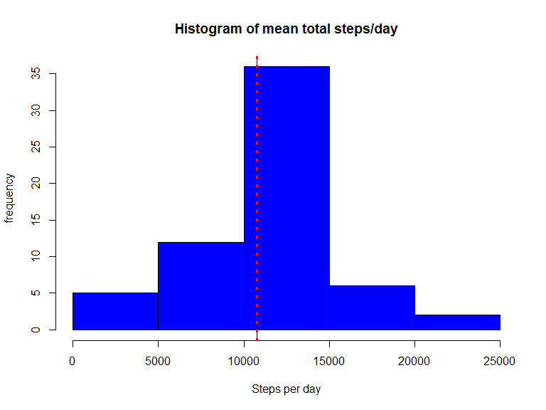

##Introduction

This assignment makes use of data from a personal activity monitoring device. This device collects data at 5 minute intervals through out the day. The data was collected for two months (Oct and Nov 2012) from an anonymous individual and include the number of steps taken in 5 minute intervals each day.

The dataset contains 3 variables and 17568 observations over a period of 61 days.

Variables:

steps: Number of steps taking in a 5-minute interval (missing values are coded as NA)

date: The date on which the measurement was taken in YYYY-MM-DD format, there are 61 days in the dataset.

interval: Identifier for the 5-minute interval in which measurement was taken, There are 288 intervals per day (24 hours * 12 intervals of 5 minutes per hour), numbered from 0 to 2355. For each day, the first interval is 0 (00.00pm), the last interval is 2355 (11.55pm)


##Load all required packages

```r
library(lubridate)
```

```
## Warning: package 'lubridate' was built under R version 3.6.1
```

```
## 
## Attaching package: 'lubridate'
```

```
## The following object is masked from 'package:base':
## 
##     date
```

```r
library(ggplot2)
```

```
## Registered S3 methods overwritten by 'ggplot2':
##   method         from 
##   [.quosures     rlang
##   c.quosures     rlang
##   print.quosures rlang
```

## Loading and preprocessing the data
- First the working directory is set.
- The file is then loaded and read


```r
activity <- read.csv("activity.csv", header = TRUE, na.strings = "NA")
```

-The date is then converted into the right format


```r
activity$date <- ymd(activity$date)
```

-next we inspect the dataset


```r
head (activity)
```

```
##   steps       date interval
## 1    NA 2012-10-01        0
## 2    NA 2012-10-01        5
## 3    NA 2012-10-01       10
## 4    NA 2012-10-01       15
## 5    NA 2012-10-01       20
## 6    NA 2012-10-01       25
```

```r
summary(activity)
```

```
##      steps             date               interval     
##  Min.   :  0.00   Min.   :2012-10-01   Min.   :   0.0  
##  1st Qu.:  0.00   1st Qu.:2012-10-16   1st Qu.: 588.8  
##  Median :  0.00   Median :2012-10-31   Median :1177.5  
##  Mean   : 37.38   Mean   :2012-10-31   Mean   :1177.5  
##  3rd Qu.: 12.00   3rd Qu.:2012-11-15   3rd Qu.:1766.2  
##  Max.   :806.00   Max.   :2012-11-30   Max.   :2355.0  
##  NA's   :2304
```

```r
str(activity)
```

```
## 'data.frame':	17568 obs. of  3 variables:
##  $ steps   : int  NA NA NA NA NA NA NA NA NA NA ...
##  $ date    : Date, format: "2012-10-01" "2012-10-01" ...
##  $ interval: int  0 5 10 15 20 25 30 35 40 45 ...
```

## What is mean total number of steps taken per day?

- To calculate the mean total number of steps per day, we first use the aggregate function and remove missing values (NA's) as mentioned in the question. 


```r
steps_per_day <- aggregate(steps~date, data = activity, FUN = sum, na.rm=TRUE)

mean_steps <- as.integer(mean(steps_per_day$steps))

median_steps <- as.integer(median(steps_per_day$steps))

hist(steps_per_day$steps, xlab = "Steps per day", ylab = "frequency", 
     main = "Histogram of mean total steps/day", col= "blue")
abline(v=c(mean_steps,median_steps), col=c("black", "red"), lty=c(1,3), lwd=c(1, 3))
```

<!-- -->

```r
sprintf("the mean steps is %g", mean_steps)
```

```
## [1] "the mean steps is 10766"
```

```r
sprintf("the median steps is %g", median_steps)
```

```
## [1] "the median steps is 10765"
```


## What is the average daily activity pattern?

-To calculate the average daily pattern, we will first create a time-series graph with the 5 minute intervals on the x-axis and the average number of steps per day averaged across all days in the y-axis. 


```r
steps_mean <- aggregate(steps~interval, data = activity, FUN = mean, na.rm=TRUE)
plot(steps_mean$interval, steps_mean$steps,col="blue", type = "l", xlab = "intervals", 
     ylab ="total steps per interval", main= "average daily activity pattern" )
```

<!-- -->

##Which is the 5-minute interval that, on average, contains the maximum number of steps


```r
max_step <- max(steps_mean$steps)
max_int <- steps_mean$interval[which(steps_mean$step == max_step)]

sprintf("the maximum number of steps for a 5-miniute interval is %g",max_step)
```

```
## [1] "the maximum number of steps for a 5-miniute interval is 206.17"
```

```r
sprintf("this corresponds to the %gth interval", max_int)
```

```
## [1] "this corresponds to the 835th interval"
```

## Imputing missing values
- Calculate and report the total number of missing values in the dataset (i.e. the total number of rows with NA's)

```r
sum(is.na(activity))
```

```
## [1] 2304
```
To check how to impute the missing values in the activity data frame, we will first plot
how the missing values are spread


```r
missing <- subset(activity, is.na(steps))
hist(missing$interval, main = "Spread of NA's over intervals")
```

<!-- -->

```r
hist(as.numeric(missing$date), main = "Spread of NA's over dates")
```

<!-- -->

The NA's seem equally spread over different intervals and there seem to be na's only on some dates. To correct for this, we can take the mean for the missing intervals across all days.


```r
##calculate mean across intervals
mean_interval <- tapply(activity$steps,activity$interval, mean,na.rm=T)
##split data into NA and not NA
nas <- activity[is.na(activity$steps), ]
nona <-activity[!is.na(activity$steps), ]
##replace missing values
nas$steps <- as.factor(nas$interval)
levels(nas$steps) <- mean_interval
levels(nas$steps)<- round(as.numeric(levels(nas$steps)))
nas$steps <- as.integer(as.vector(nas$steps))
new_table <- rbind(nas,nona)
```
-Make a histogram of the total number of steps taken each day and Calculate and report the mean and median total number of steps taken per day. Do these values differ from the estimates from the first part of the assignment? What is the impact of imputing missing data on the estimates of the total daily number of steps?


```r
new_steps_per_day <- aggregate(steps~date, data = new_table, FUN = sum, na.rm=TRUE)

mean_new_steps <- as.integer(mean(new_steps_per_day$steps))

median_new_steps <- as.integer(median(new_steps_per_day$steps))

hist(new_steps_per_day$steps, xlab = "Steps per day", ylab = "frequency", 
     main = "Histogram of mean total steps/day", col= "blue")
abline(v=c(mean_new_steps,median_new_steps), col=c("black", "red"), lty=c(1,3), lwd=c(1, 3))
```

<!-- -->

```r
sprintf("the mean steps is %g",mean_new_steps)
```

```
## [1] "the mean steps is 10765"
```

```r
sprintf("the median steps is %g", median_new_steps)
```

```
## [1] "the median steps is 10762"
```

The results are very similar. 

## Are there differences in activity patterns between weekdays and weekends?

For this part the \color{red}{\verb|weekdays()|}weekdays() function may be of some help here. Use the dataset with the filled-in missing values for this part.

Create a new factor variable in the dataset with two levels – “weekday” and “weekend” indicating whether a given date is a weekday or weekend day.


```r
weekdays1 <- c('Monday', 'Tuesday', 'Wednesday', 'Thursday', 'Friday')

new_table$day <- factor((weekdays(new_table$date) %in% weekdays1), 
         levels=c(FALSE, TRUE), labels=c('weekend', 'weekday'))
```

Make a panel plot containing a time series plot (i.e. \color{red}{\verb|type = "l"|}type="l") of the 5-minute interval (x-axis) and the average number of steps taken, averaged across all weekday days or weekend days (y-axis). 


```r
mean_step_day <- aggregate(steps~interval+day, data = new_table, FUN = mean, na.rm=TRUE)
time_series <- ggplot(mean_step_day, aes(interval,steps))
time_series + geom_line(color="black")+facet_grid (day~.) +labs(x="intervals",y="total      steps per interval", main = "average activity patterns over weekends and weekdays")
```

<!-- -->

From the graphs it looks like people start walking earlier on weekdays and the more consistently during the weekends. 
